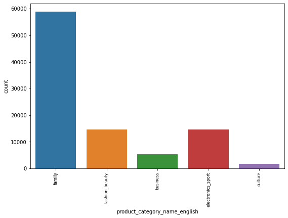
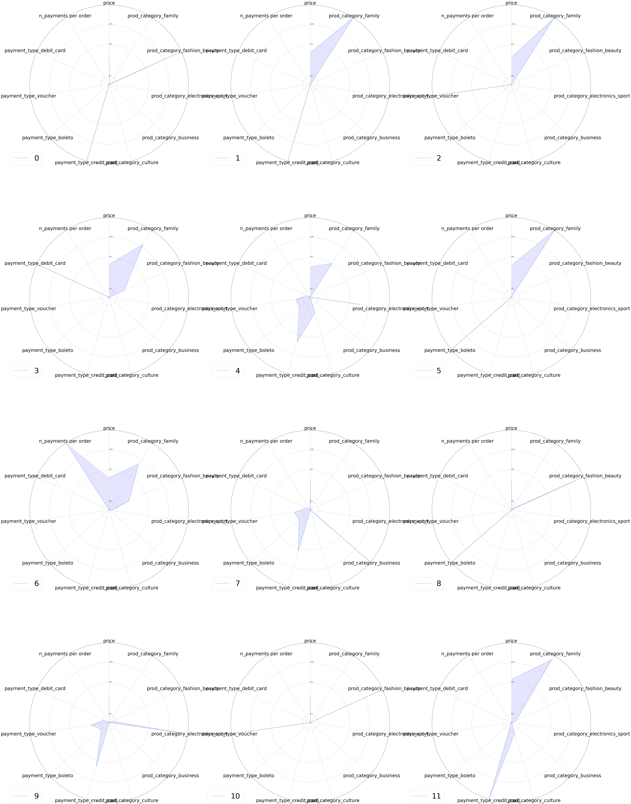

# Clients segmentation

## Project overview

* this project consists of **estimating a segmentation model** that would separate the e-consumers of a platform into **coherent** and **business-wise interpretable** groups

* thus the project consists of a **clustering** task with **tabular data**

* the defined clusters are quite **robust**, well **balanced** and **meaningful** in a business-sense  
&nbsp;

## Workflow summary

* **aggregated** the tables of the [database](https://www.kaggle.com/olistbr/brazilian-ecommerce)

* **cleaned** the data

* **explored** the data

* implemented **feature engineering** on both **numeric** and **categorical** features

* defined the best subset of features with KMeans

* compared **KMeans**, **DBSCAN** and **GMM** estimators on three criteria:
    * separability
    * balance among clusters
    * clusters interpreation 

* controlled for **initialization resistance** and **temporal stability** of the chosen model

&nbsp;

## Project installation

* use command pip install -r requirements.txt to install the dependencies

* the data is directly available [here](https://www.kaggle.com/olistbr/brazilian-ecommerce).  The csv files should be stored in a folder named Data to reproduce code in the cleaning notebook

* the cleaned data ready for exploration and modelling is available in the project repository under the name cleaned_data.csv and may be read directly by the modelling notebook

&nbsp;

## Detailed workflow

## **Aggregating tables**

* The database contains multiple tables.
* We will aggregate each table when needed and merge ot with the table they communicate it.
* For each table we will create one feature that counts the number of occurrences for each key of the table
* Numeric features of interest will be aggregated by mean.
* Categorical features of interest will be aggregated by most common value, or one-hot-encoded if the number of labels is low, then aggregated as numeric features.

## **Cleaning**

### **Shape, duplicates and missing values**

&nbsp;

* There are very few **missing values** in the table.
* We can see that there are **some samples** where value is missing for **many features** though.
* We will **delete** these samples before further analysis.
&nbsp;

## **Exploration**

### **Product category feature**

&nbsp;

* The 'product_category' feature has many labels, with some labels being represented by very little number of samples.

* We may merge these categories into fewer ones to be able to use this feature during modelling.

* The mapping between old and new labels should be meaningful.
&nbsp;
 

#### **Feature transformation**

&nbsp;

* The new feature has only five labels.
* Distribution is quite unbalanced, with 'family' the main category.
* However each label is represented by a reasonable amount of samples.
&nbsp;

### **Numeric features**

&nbsp;

* Most of the distributions are **strongly skewed** to the right.
* A **log-transformation** of the features may be needed here to **normalize** the distributions.
* Gaussian-like distributions is a key assumption of some clustering algorithms such as **KMeans**.
&nbsp;

#### **Log-transformation**

&nbsp;

* The distributions of continuous features such as **price, payment, freight_value** are more Gaussian-like after log-transformation.
* The log-transformation did not serve to normalize features with **discrete values**. The distributions remain skewed to the left.
* However we will perform the transformation as well to be **consistent accross features**.

#### **Feature engineering : product volume = length * width * height**

* From product length, width & height we will create one 'volume' feature that will be the product of the values within these three features for each sample
&nbsp;

## **Modelling**

* The workflow is structured as follows:

    * Generate clusters with **KMeans** on all features
    * Compute **silhouette score** for each n_clusters parameter-value
    * Analyze **silhouette score per cluster** for different parameter values
    * **Interpret** the clusters
    
* We will repeat the workflow for different subsets of features
* The goal is to find:
    * **well separated** clusters for given subset of features
    * **well balanced** clusters 
    * **meaningful** clusters in a **business-sense** so that targeted marketing strategies may be implemented
    * number of features as well as clusters should be as low as possible to be interpretable
&nbsp;

## **Clustering**

### **Subset of data**

Since data is large, and computing silhouette score is time-consuming (quadratic complexity), we will work on a 10% subsample for the rest of the analysis.
&nbsp;

### **KMeans**

* KMeans is one of the most useful algorithms for clustering.
* It is :
    * simple
    * fast
    * often accurate

#### **All features**

**Silhouette score**

&nbsp;

* We can measure the optimal number of clusters either using the 'elbow' method on the inertia plot or upon silhouette scores. 
* Selecting optimal parameter-value with silhouette is more robust since it calculates distances accross clusters and therefore quantifies their separability. 
* Here the silhouette scores on all features are weak, much close to 0 than 1, which mean clusters overlap.
&nbsp;

**Silhouette score per cluster**

&nbsp;

Some **samples** of some clusters **are actually closer to samples from other clusters than theirs**.
&nbsp;

**Clusters interpretation**

&nbsp;

* The shapes of the clusters are **difficult to distinguish one from another**.
* The clusters are **poorly separated**.
* Some features are poorly represented.

#### **Features subset 1**

**Silhouette score**

&nbsp;

* **Silhouette scores** for this subset of features are **higher** on overall.
* We reach a maximum for n_clusters = 6

**Silhouette per cluster**

&nbsp;

Size of the clusters are more balanced** when **k = 7**, even though the overall silhouette score is slightly lower.
&nbsp;

**Clusters interpretation**

&nbsp;

* The clusters are **better separated** on this subset of features
* The shapes of the **clusters** are quite **different and interpretable**
* But the main clusters in terms of weight, especially 1 & 5, are not that different
&nbsp;

#### **Features subset 4**
&nbsp;

**Silhouette score**

&nbsp;

* **Optimal separability** is reached for **k = 9**
* However other parameter values may produce **better balanced clusters and/or better clusters interpretation**
&nbsp;

**Silhouette score per cluster**

&nbsp;

* Samples are better **balanced** accross labels for k = 15
* The clusters are **well separated** for that parameter value, even though some samples in few clusters seem to be misclassified, but it is also the case with lower numbers of clusters.

&nbsp;

* The clusters are businesswise **meaningful**
* They give **insights** on the consumers **behaviors**
&nbsp;

### **DBSCAN**

We will try other estimators with the same subset of features.

&nbsp;

**Silhouette score**

&nbsp;

**Silhouette per cluster**

&nbsp;

* Silhouette score is better for k = 4, but clusters are highly unbalanced.
* Models with k = 13 or k = 17 produce **robust** clusters on the overall, despite **some samples seem misclassified**
* Clusters are still **unbalanced** with a **single cluster that contains most of the samples**

* Silhouette score is better for k = 4, but clusters are highly unbalanced.
* Models with k = 13 or k = 17 produce robust clusters on the overall, despite **some samples seem misclassified**
* Clusters are still unbalanced with a single cluster that contains most of the **samples**
&nbsp;

**Clusters interpretation**

&nbsp;

* Clusters have different shapes but there is an **overrepresented cluster**
* The clusters are **less well separated** than with KMeans, with an inferior overall silhouette score
* As for now we will keep KMeans solution
&nbsp;

### **GMM**

**Silhouette score**

* We will estimate clusters with GaussianMixtureModel on the same subset of features

&nbsp;

* We seem to reach an optimal silhouette score for **k = 12**
* Optimal parameter values go from **8** to **13** clusters
* Clusters seem **better separated** than with KMeans

**Silhouette per cluster**

&nbsp;

* The optimal value is for **k = 12**
* Distribution of clusters are quite **unbalanced**, with a cluster containing approximatively half of the samples
&nbsp;

**Clusters intepretation**

&nbsp;

* Clusters have **different shapes** and give **business insights**
* Even though the overall **silhouette score** is slightly higher than with **KMeans**, the clusters are **better balanced** with the latter
* The proportion of probably-**misclassified** samples is also higher than with KMeans
* For these reasons we will keep **KMeans** as the best clusters' estimator
&nbsp;

### **Best model : KMeans, n_clusters = 15**
&nbsp;

### **Clusters robustness accross estimators**

* For a common number of fitted clusters (13), we will perform **Adjusted Rand Score** between KMeans labels and both DBSCAN & GMM

* This will give us an insight on the **robustness** of the clusters: are they **resistant** accross estimators or are they specific to each estimator ?

* Previous plots suggest that clusters are first defined by the clustering algorith method, but to what extent ?

&nbsp;

Interesting to note that GMM fitted clusters are quite close to both KMeans and DBSCAN clusters, whereas KMeans and DBSCAN clusters are to each other closer to random permutation than to consistent mapping.
&nbsp;
   

### **Initialization resistance**

* Since **KMeans** is sensitive to the initial position of the centroids when fitting a model, finding only local optima, we will assess the robustness of the fitted clusters by implementing the estimator **through different random states**

* Robust clusters should resist **different initialization states**

* This will be quantified computing adjusted rand score between a set of reference labels and sets of predicted labels with **different random states**

* The closer to 1 the better

&nbsp;

* The clusters **persistency** accross initializations is **satisfying**

* The preservation of the groups is nearly optimal in most of the initializations (ARI score really close to 1)

* It suggests that the fitted clusters are **really underlying to the data**
&nbsp;

### **Model temporal stability**

* We will now control for the temporal stability of the model

* For how long will it remain relevant ?

* The workflow is as follows:
    * we will filter on one year of orders 
    * aggregate the filtered data and predict labels which will be our reference labels
    * add one month of consumption, aggregate the data, fit the model and predict new labels
    * compute ARI score on our reference population between these two periods
    * repeat the steps adding one month at a time
    * this process will give us an insight of the persistency of the model over time
&nbsp;

    

&nbsp;

* The **persistency** of clusters accross time is irregular

* However on the overall the clusters computed on the first year of orders **are robust accross time**  

&nbsp;

# **Conclusion**

* We built a **KMeans clustering model** that fitted **well separated**, **well balanced** and **meaningful** clusters

* We are confident it may serve as a basis for implementing an online marketing strategy

* Though the model is robust accross time, **updating the model** may be useful 

* Further research shall try to **add new features** either by **aggregation or transformation**, and also try other **estimators**
&nbsp;

## The cleaning & exploration notebook is accessible [here](cleaning_exploration.ipynb) and the modelling notebook [here](modelling.ipynb). Both notebooks may be run immediately after **unzipping** the **Data** file.

